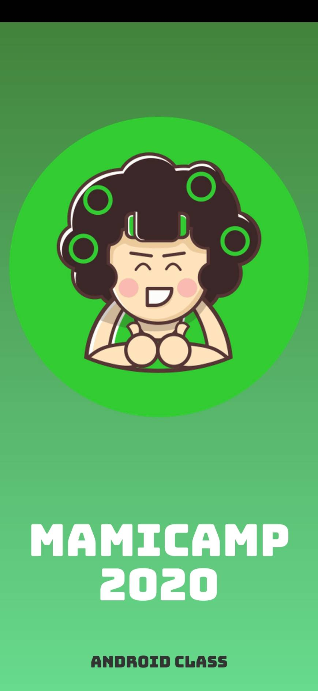
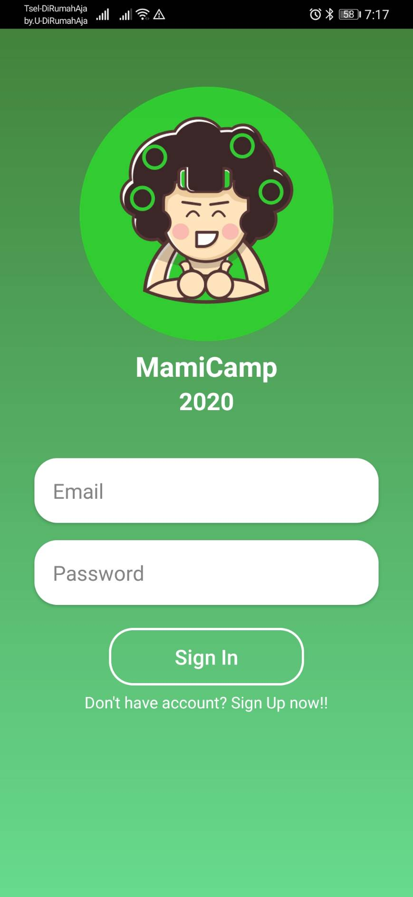
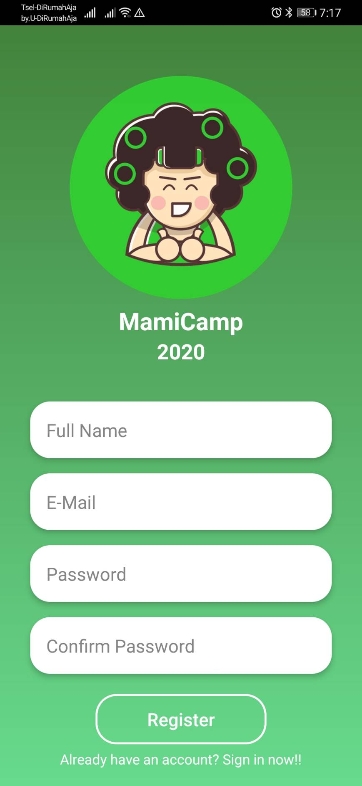
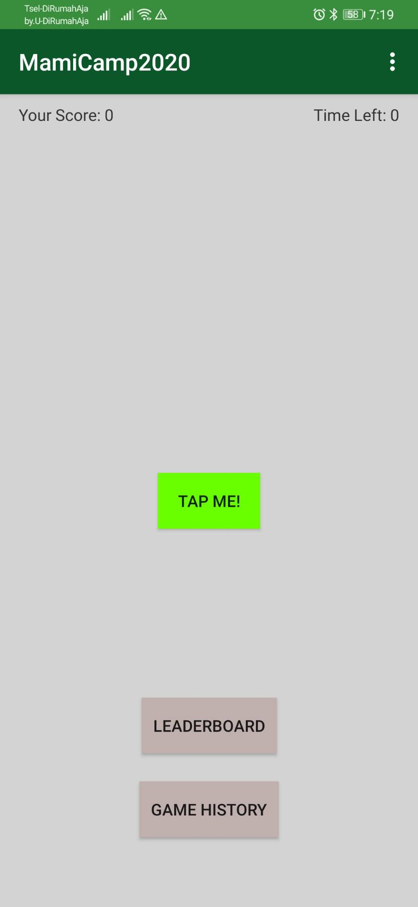
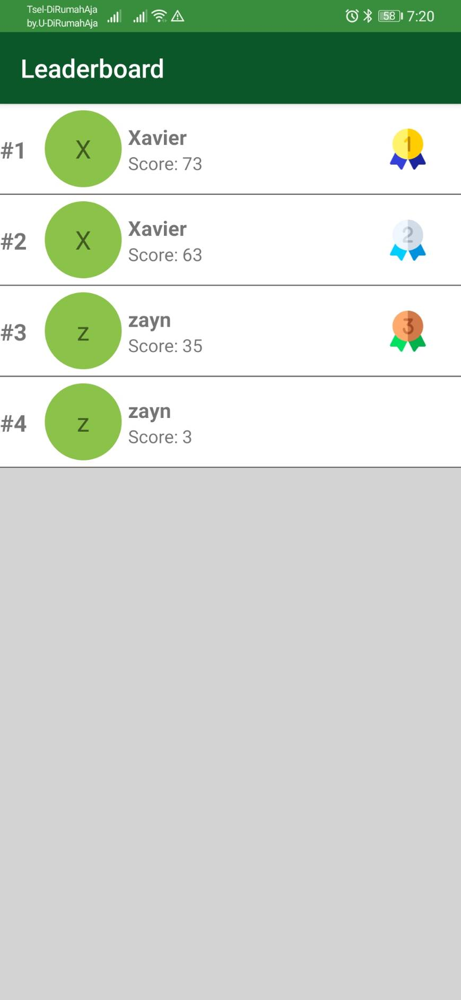
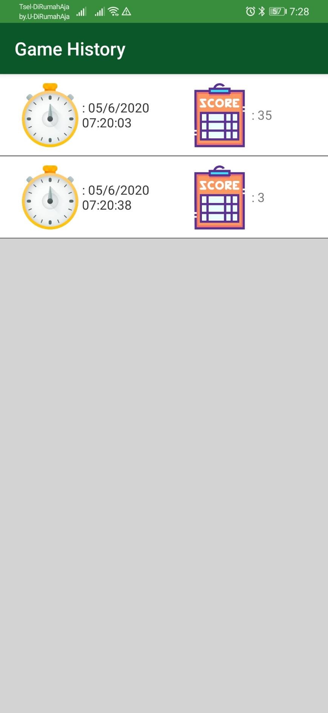

# MamiCamp2020
Repository for MamiCamp 2020. There are 2 branches that I made for this project, the first is "master" 
branch which follows original tutorial from raywenderlich and
"my-version" branch which is a variation that I made from tutorial application.

in this branch I will add several features.
- Implement Android Jetpack Navigation component 
- Before playing this game, user need to register with email. in this feature I use Firebase authentication
- every game ends,the final score will be stored in cloud database for game records and leaderboard
- There is new button to display game records and leaderboard page for user, that is displayed from Firebase Cloud Firestore.
- Top 10 score will be displayed on the leaderboard page

Screenshot Application
1. Splash Screen

2. Login Screen

3. Register Screen

4. Game Screen

5. Leaderboard Screen

6. History Screen

